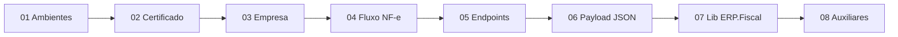

# Documentação — ERP.Fiscal

> **Progressive disclosure:** este arquivo é o **único ponto de entrada** para agentes de IA. Carregue apenas o documento indicado pelo contexto da tarefa — não leia tudo de uma vez.
>
> **Última verificação:** 2026-07-06 — fonte [docs.plugnotas.com.br](https://docs.plugnotas.com.br). Manutenção: skill [sync-plugnotas-docs](../.agents/skills/sync-plugnotas-docs/SKILL.md).

Biblioteca compartilhada de integração fiscal via **PlugNotas** (TecnoSpeed). Stack: ABP (.NET 10), backend-only.

---

## Quando usar cada documento

| Contexto da tarefa | Leia primeiro |
|--------------------|---------------|
| Qualquer integração PlugNotas | [`plugnotas/README.md`](plugnotas/README.md) |
| Configurar API key, sandbox, hosts HTTP | [`plugnotas/01-ambientes-autenticacao.md`](plugnotas/01-ambientes-autenticacao.md) |
| Upload/consulta de certificado A1 | [`plugnotas/02-certificado-digital.md`](plugnotas/02-certificado-digital.md) |
| Cadastro de emissor/empresa no provedor | [`plugnotas/03-empresa-emissor.md`](plugnotas/03-empresa-emissor.md) |
| Fluxo assíncrono de emissão NF-e | [`plugnotas/04-nfe-fluxo-emissao.md`](plugnotas/04-nfe-fluxo-emissao.md) |
| Rotas HTTP NF-e (POST/GET, cancelamento, XML/PDF) | [`plugnotas/05-nfe-endpoints.md`](plugnotas/05-nfe-endpoints.md) |
| Montar payload JSON NF-e (builder no ERP) | [`plugnotas/06-nfe-payload-json.md`](plugnotas/06-nfe-payload-json.md) |
| Implementar/alterar `ERP.Fiscal.PlugNotas` | [`plugnotas/07-mapeamento-erp-fiscal.md`](plugnotas/07-mapeamento-erp-fiscal.md) |
| Padronizar consumo em ERP consumidor (Marchante, Florestal, FiscalWR) | [`consumers/padrao-integracao.md`](consumers/padrao-integracao.md) |
| Consulta CNPJ/CEP (auxiliares) | [`plugnotas/08-auxiliares-cnpj-cep.md`](plugnotas/08-auxiliares-cnpj-cep.md) |
| Segurança — segredos, Husky, auditoria Git | [`security/README.md`](security/README.md) → skill [`security-check`](../.agents/skills/security-check/SKILL.md) |
| Antes de commit / release / `/security-check` | [`security/README.md`](security/README.md) |

---

## Ordem recomendada (onboarding)

Pré-requisito PlugNotas antes da primeira NF-e: **certificado cadastrado** → **empresa cadastrada com NF-e ativo** → **POST /nfe**.

---

## Fontes oficiais (sempre preferir para detalhe de campo)

| Fonte | URL | Uso |
|-------|-----|-----|
| Swagger/OpenAPI (canônico, atualizado no deploy) | https://docs.plugnotas.com.br | Schema completo, exemplos, validações |
| Zendesk — primeiros passos NF-e | https://atendimento.tecnospeed.com.br/hc/pt-br/articles/24725044940951 | Fluxo assíncrono, lista de rotas |
| Zendesk — certificado e empresa | https://atendimento.tecnospeed.com.br/hc/pt-br/articles/360055614214 | Tutorial cadastro via API |
| Postman | https://documenter.getpostman.com/view/3720339/2sB3WpSh1R | Testes manuais e exemplos por linguagem |

Estes `.md` são **compilação de referência para agentes** — extraídos da documentação oficial. Para campos novos ou dúvida de validação, consulte o Swagger. **Ao implementar ou corrigir integração**, use a skill [`sync-plugnotas-docs`](../.agents/skills/sync-plugnotas-docs/SKILL.md) para checar a fonte oficial e atualizar os arquivos locais.

---

## Outros artefatos do repositório

| Arquivo | Função |
|---------|--------|
| [`../AGENTS.md`](../AGENTS.md) | Instruções gerais para agentes (fronteira da lib, onde colocar código) |
| [`../README.md`](../README.md) | Visão geral e quick start |
| [`security/README.md`](security/README.md) | Índice segurança (Husky, scripts, Gitleaks, histórico Git) |
| [`.agents/skills/security-check/SKILL.md`](../.agents/skills/security-check/SKILL.md) | Procedimento detalhado de checagem (fases A–F) |
