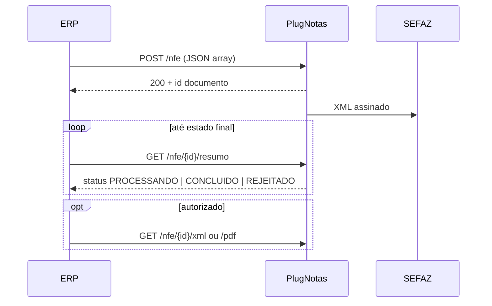

# PlugNotas — Fluxo de emissão NF-e

```yaml
agent:
  when_to_read: Orquestrar transmissão, polling pós-POST, interpretar status CONCLUIDO/PROCESSANDO/REJEITADO
  official: https://docs.plugnotas.com.br/#tag/NFe
  zendesk: https://atendimento.tecnospeed.com.br/hc/pt-br/articles/24725044940951-Sobre-a-Nota-Fiscal-de-Produto-Primeiros-Passos-NF-e
  lib: INfeEmissaoProvider, PlugNotasNfeConsultaRespostaParser
```

---

## Natureza assíncrona

O **POST `/nfe` não retorna autorização SEFAZ**. Retorna:

- **Sucesso HTTP 2xx:** ID do documento no PlugNotas (`documents[].id`, ~24 caracteres hex) e opcionalmente `protocol` de lote (GUID).
- **Erro 4xx:** validação de schema/regra de negócio antes do envio à SEFAZ.

Após o POST, PlugNotas:

1. Valida JSON
2. Busca cadastro da empresa
3. Define numeração (se automática)
4. Calcula impostos faltantes
5. Monta XML e envia à SEFAZ
6. Disponibiliza resultado via **consulta** ou **webhook**

---

## Fluxo com consulta (polling)



### Ações por status

| Status PlugNotas | Ação ERP |
|------------------|----------|
| `PROCESSANDO`, `AGENDADO`, `AGUARDANDO` | Aguardar e consultar novamente |
| `CONCLUIDO` | Autorizada — opcional baixar XML/PDF |
| `REJEITADO` | Analisar `cStat`/`mensagem`, corrigir, **novo envio** |
| `CANCELADO` | Documento cancelado |

### Status SEFAZ (`cStat`) na consulta

| cStat | Situação |
|-------|----------|
| 100 | Autorizada |
| 110, 205, 301, 302, 401 | Rejeitada |
| 135, 136, 155 | Cancelada |

O parser `PlugNotasNfeConsultaRespostaParser` normaliza para `NfeSituacao` (`Autorizada`, `Processando`, `Rejeitada`, `Cancelada`, `Desconhecido`).

---

## Fluxo com Webhook

Configure webhook na organização ou empresa (documentação PlugNotas — tag Webhook).

- POST `/nfe` igual ao fluxo de consulta
- PlugNotas notifica quando status é **final** (`CONCLUIDO` ou `REJEITADO`)
- **Notas em processamento não geram webhook** — apenas estados finais

ERP consumidor implementa endpoint receptor; a lib **não** trata webhooks.

---

## POST `/nfe` — regras importantes

| Regra | Detalhe |
|-------|---------|
| Body | **Array JSON na raiz** — cada elemento = 1 NF-e |
| Lote máximo | 500 notas por requisição |
| `idIntegracao` | **Único por nota** — idempotência; reenvio duplicado é ignorado |
| Content-Type | `application/json` |
| Assíncrono | Consultar via `/nfe/{id}/resumo` ou webhook |

### Resposta típica de sucesso

```json
{
  "documents": [
    {
      "id": "66958a6505757b0e34f1344a",
      "idIntegracao": "a1b2c3d4e5f6478990abcdef12345678"
    }
  ],
  "protocol": "2e31e63a-006d-46d2-9a7a-216d39abae6e"
}
```

> `protocol` na raiz é **lote PlugNotas** (GUID), não confundir com protocolo SEFAZ (`nProt`, numérico ~15 dígitos) obtido na consulta.

---

## Identificadores para consulta

| Identificador | Uso |
|---------------|-----|
| `id` PlugNotas (~24 hex) | `GET /nfe/{id}/resumo`, `/xml`, `/pdf` |
| `idIntegracao` + CNPJ emitente | `GET /nfe/{cnpj}/{idIntegracao}/resumo` |
| Chave de acesso (44 dígitos) | Alternativa em rotas `{idNotaOrChave}` |

Nos ERPs, `idIntegracao` costuma ser GUID da nota local (32 hex sem hífens).

---

## Cancelamento

```http
POST /nfe/{idNota}/cancelamento
Content-Type: application/json

{ "justificativa": "Motivo com mínimo 15 caracteres" }
```

Assíncrono — consultar `GET /nfe/{idNota}/cancelamento/status`.

Lib: `INfeEmissaoProvider.CancelarAsync`.

---

## Retry (lib ERP.Fiscal)

POST `/nfe` possui retry configurável para falhas **transitórias** (5xx, timeout, rede). Erros 4xx de validação **não** são retentados.

---

## Pré-requisitos (checklist)

- [ ] Certificado cadastrado
- [ ] Empresa cadastrada com `nfe.ativo: true`
- [ ] Certificado vinculado (`certificado` no POST empresa)
- [ ] Ambiente correto (`config.producao` alinhado à intenção)
- [ ] Payload JSON válido (array na raiz)

---

## Documentos relacionados

- Rotas completas: [`05-nfe-endpoints.md`](05-nfe-endpoints.md)
- Estrutura JSON: [`06-nfe-payload-json.md`](06-nfe-payload-json.md)
- Lib: [`07-mapeamento-erp-fiscal.md`](07-mapeamento-erp-fiscal.md)
